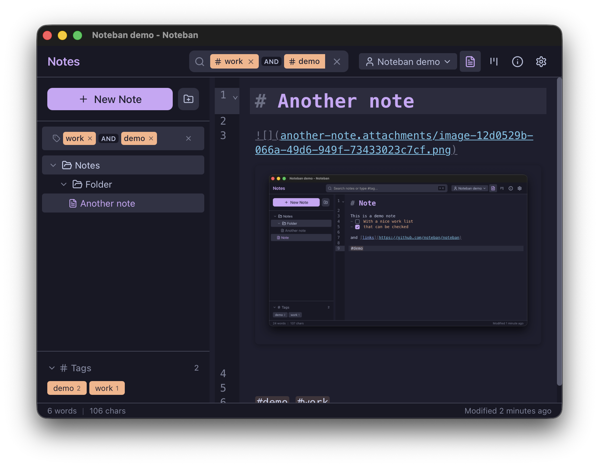

# Noteban

This is a small note app to satisfy my own needs more than anything.

It features tags, screenshots and checkboxes in the notes, but also shows the note in a kanban board, this information is stored in a frontmatter header.

## AI Tag Suggestions

Noteban can suggest tags for your notes using local AI models via [Ollama](https://ollama.com/).

To enable:
1. Install and run Ollama on your machine (or use a remote instance)
2. Open Settings and enable "AI Tag Suggestions"
3. Configure the server URL (default: `http://localhost:11434`)
4. Select a model from the dropdown

Once configured, click the sparkles button in the editor toolbar to get AI-generated tag suggestions based on your note's content.
