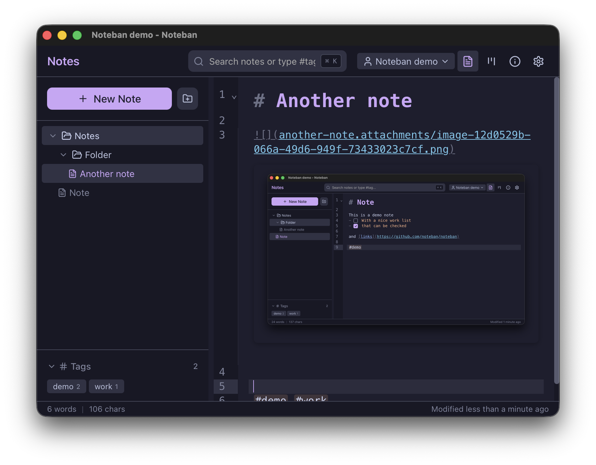
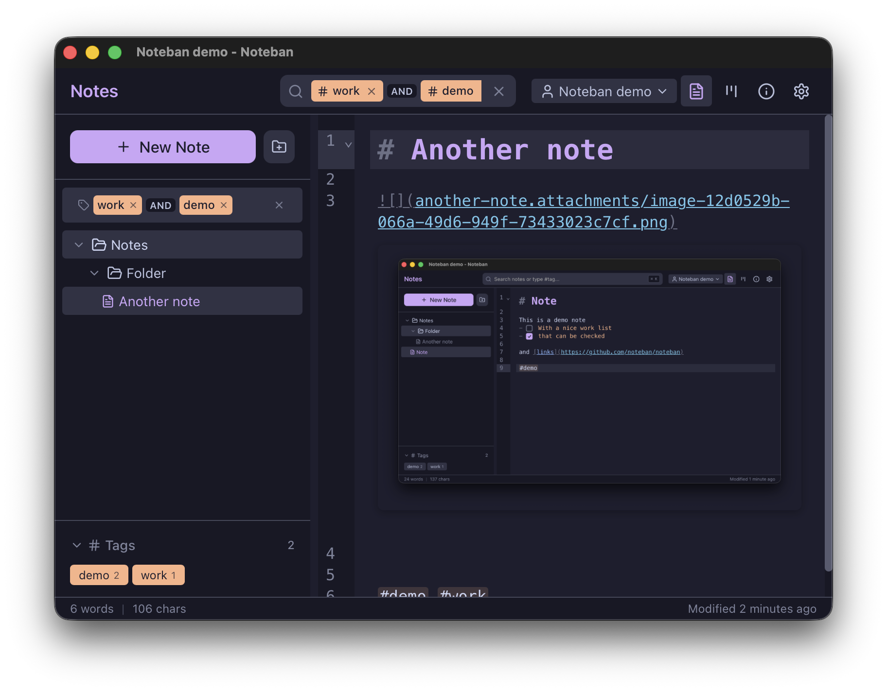
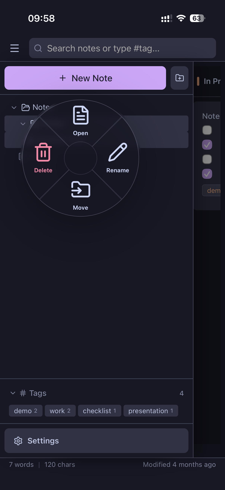
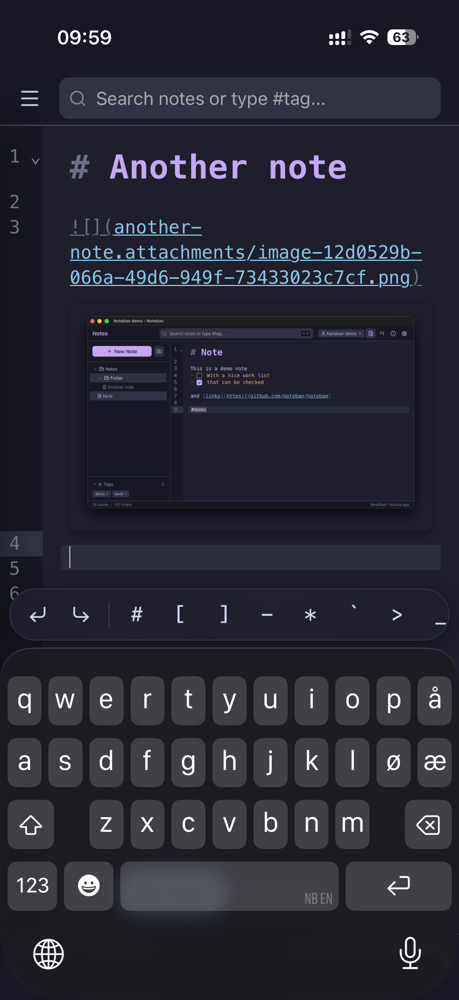

# Noteban

This is a small note app to satisfy my own needs more than anything.

It features tags, screenshots and checkboxes in the notes, but also shows the note in a kanban board, this information is stored in a frontmatter header.







## Inline Math

Write an expression and end the line with `=` — the result appears right there in the editor, Apple Notes-style. Results are display-only and never written to the file.

```text
groceries = 320 NOK
groceries + 25% =        → 400 NOK

transfer = 8MB + 200kB
transfer / 2s =          → 4.1 MB/s

255 in hex =             → 0xFF
```

- **Variables** — `name = expression` defines a value for the lines below it; `pi` and `e` are built in.
- **Operators** — `+ - * / ^ %` (also `× ÷`), parentheses, and Apple-style percents: `100 + 20% =` gives 120.
- **Functions** — `sqrt`, `abs`, `round`, `floor`, `ceil`, `ln`, `log2`, `log10`, `exp`, `pow`, `min`, `max`, and `sin` / `cos` / `tan` / `asin` / `acos` / `atan` (in degrees).
- **Units** — data (`kB`–`TB`, `KiB`, bits), time (`ms`–`d`), length, mass, energy, power, frequency, and rates like `MB/s`. Convert with `in`: `90min in h =`.
- **Currencies** — `$ € £ ¥ kr` and ISO codes (`100 NOK + 50 NOK =`). No exchange rates — currencies must match. `$ = USD` pins what a symbol means.
- **Number formats** — hex and binary in and out (`0xFF =` and `0b1010 =` as input, `255 in hex =` and `10 in bin =` to convert), scale suffixes (`8k`, `32G`), and spelled-out multipliers (`3 million`).

Math is skipped in code blocks and frontmatter, and anything after `#` on a line is ignored.

## AI Tag Suggestions

Noteban can suggest tags for your notes using local AI models via [Ollama](https://ollama.com/).

To enable:
1. Install and run Ollama on your machine (or use a remote instance)
2. Open Settings and enable "AI Tag Suggestions"
3. Configure the server URL (default: `http://localhost:11434`)
4. Select a model from the dropdown

Once configured, click the sparkles button in the editor toolbar to get AI-generated tag suggestions based on your note's content.
